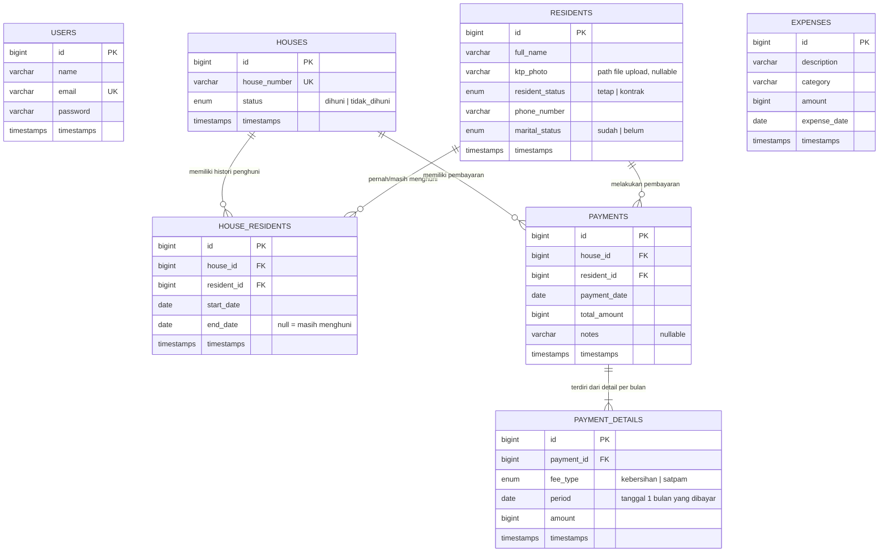

# ERD — Aplikasi Administrasi RT

## Diagram

## Penjelasan Relasi

| Tabel | Peran |
|---|---|
| `users` | Akun admin untuk login aplikasi (Laravel Sanctum token). |
| `residents` | Data penghuni: nama lengkap, foto KTP (upload), status penghuni (tetap/kontrak), nomor telepon, status pernikahan (sudah/belum). |
| `houses` | Data rumah dengan nomor unik dan status hunian (dihuni/tidak dihuni). Status dikelola otomatis saat penghuni ditempatkan/dikeluarkan. |
| `house_residents` | Tabel pivot **histori penghuni**. Setiap baris = satu periode hunian. `end_date` yang masih `NULL` berarti penghuni tersebut **aktif** menghuni rumah itu. Semua baris membentuk catatan sejarah siapa saja yang pernah menempati rumah. |
| `payments` | Header transaksi pembayaran iuran: rumah, penghuni yang membayar, tanggal bayar, dan total. |
| `payment_details` | Detail pembayaran **per bulan per jenis iuran**. Pembayaran bulanan menghasilkan 1 baris; pembayaran **tahunan iuran kebersihan** menghasilkan 12 baris (12 × Rp15.000). Status **Lunas/Belum** per rumah per bulan ditentukan dari ada/tidaknya baris detail untuk periode tersebut. |
| `expenses` | Pengeluaran operasional RT (gaji satpam, perbaikan, kegiatan, dll.). |

## Aturan Bisnis Utama

1. **Iuran Kebersihan**: Rp15.000/bulan — dapat dibayar bulanan atau **tahunan** (12 bulan sekaligus = Rp180.000).
2. **Iuran Satpam**: Rp100.000/bulan — hanya bulanan.
3. Satu rumah hanya boleh memiliki **satu penghuni aktif** pada satu waktu; penghuni juga tidak boleh aktif di dua rumah sekaligus (divalidasi backend).
4. Pembayaran ditolak jika periode + jenis iuran yang sama sudah lunas (mencegah bayar ganda).
5. Pemasukan pada report dihitung berdasarkan tanggal pembayaran diterima (cash basis); pengeluaran berdasarkan tanggal pengeluaran.
